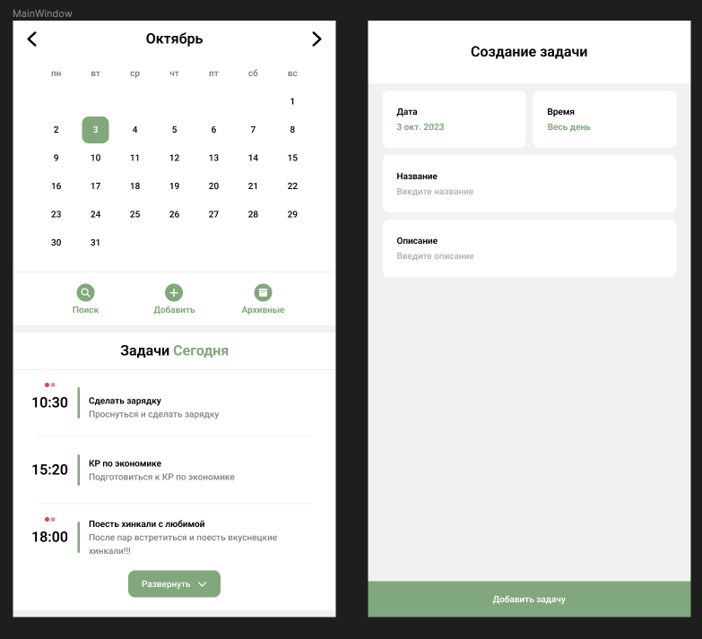

# The TaskMaster Telegram Mini-App

The idea of this [TMA (Telegram Mini-App)](https://core.telegram.org/bots/webapps) is to create a task manager with reminders right inside Telegram. Notifications about the task according to the idea will come right inside the Telegram bot. A task search will be available, all completed tasks will be sent to the archive, where they will be stored for only a week, unless the user cancels its automatic deletion.

Synchronization will also be created using [Cloud Storage](https://core.telegram.org/bots/webapps#cloudstorage) in TMA.

The web application will be created using React.

# Design

The primary design of this TMA is being developed in the Figma, but is mostly being finalized during development. When creating a design, an excellent feature of TMA is taken into account, namely, adjusting to a custom theme in Telegram.

